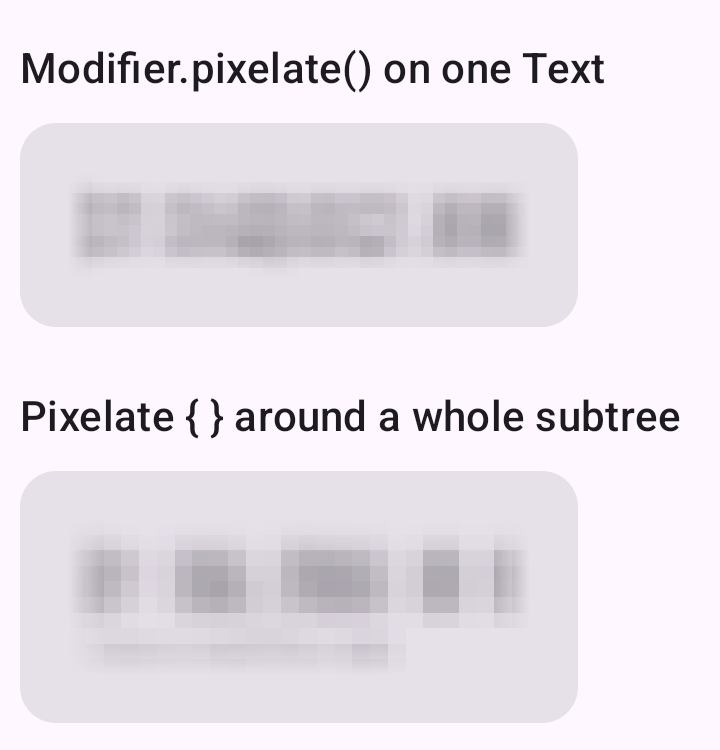
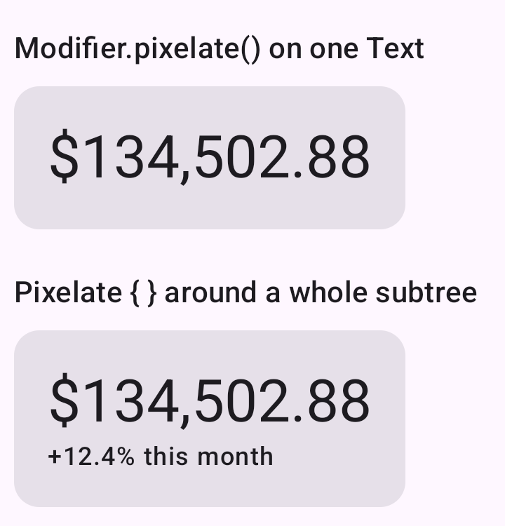

# compose-pixelate

Pixelates Compose Multiplatform content into a mosaic of solid blocks.

| Pixelated | Revealed |
|---|---|
|  |  |

The content keeps its real data and its real size, so nothing in the layout moves.

## Usage

```kotlin
Text(price, modifier = Modifier.pixelate())
```

For a whole subtree:

```kotlin
Pixelate {
    Column {
        Text(total, style = MaterialTheme.typography.headlineMedium)
        Text(change, style = MaterialTheme.typography.labelSmall)
    }
}
```

### Parameters

| Parameter | Default | |
|---|---|---|
| `blockRatio` | `0.22f` | Cell size as a fraction of content height. Bigger is blockier. |
| `minBlockSize` | `4.dp` | Stops small content collapsing into one cell. |
| `maxBlockSize` | `14.dp` | Stops tall content becoming a few huge squares. |
| `featherEdges` | `true` | Fades alpha to zero at the edges instead of hard-clipping. |

Don't go too low on `blockRatio`. At `0.14f` you can make out the digits of a 28sp price, and at
`0.08f` you can just read it. `MinimumSafeBlockRatio` (`0.18f`) is exported to assert against:

```kotlin
require(ratio >= MinimumSafeBlockRatio)
```

## How it works

Draws the content scaled down into an `ImageBitmap` at one pixel per cell, then draws it back at
full size with `FilterQuality.None`. The detail is gone at the downscale and nothing afterwards
brings it back.

Bitmaps are allocated per layout size with `drawWithCache` and cleared with `BlendMode.Src` each
frame, so the previous value can't bleed through the current one.

## Caveats

Not a security boundary. The value is still in the composition, still in the semantics tree, still
available to a screen reader or a debugger.

Costs one offscreen render of the content per frame. Don't put it on every row of a long list.

## Targets

`android`, `jvm`, `js`, `wasmJs`, `iosArm64`, `iosSimulatorArm64`.

No `iosX64`, since Compose Multiplatform 1.11 stopped publishing it.

## Installing

Not on Maven Central. Copy
[`Pixelate.kt`](pixelate/src/commonMain/kotlin/cards/sleevd/pixelate/Pixelate.kt) into your project,
or add this repo as a submodule and `include(":pixelate")`.

## Sample

```
./gradlew :sample:installDebug
```

For iOS, open `iosApp/iosApp.xcodeproj` and run the `iosApp` scheme. Pick an actual Apple-silicon
simulator rather than "Any iOS Simulator Device", which fails with `Unknown iOS simulator arch:
'x86_64'`.

## Licence

Apache 2.0.
